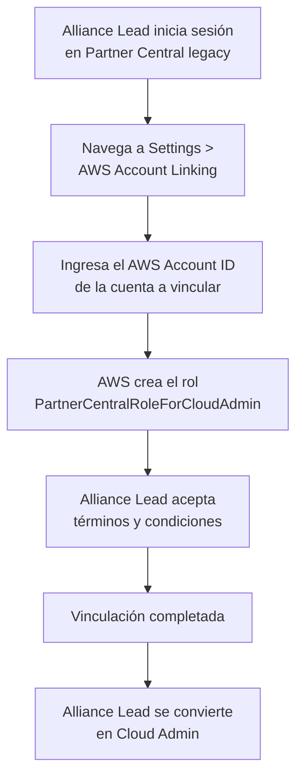
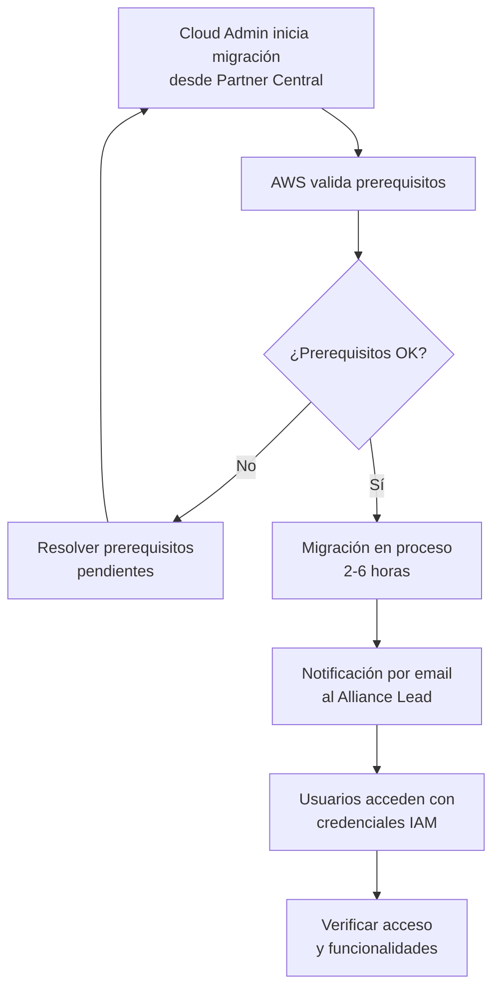
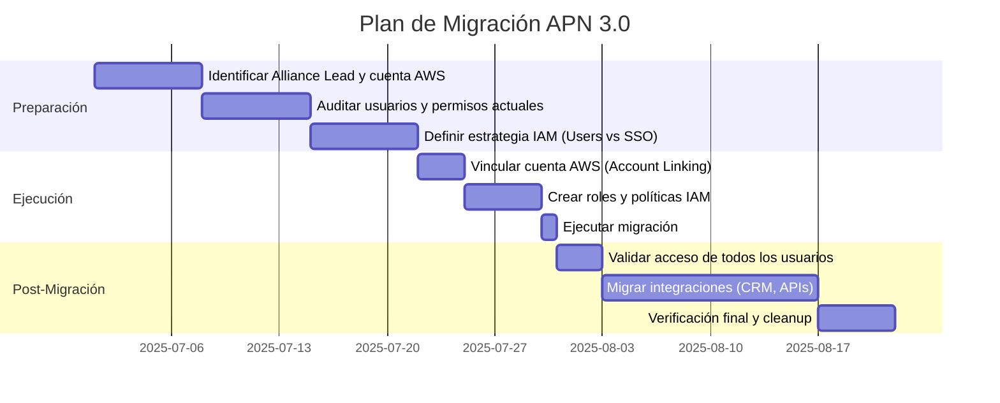

<div align="center">

# 🚀 Migración a APN 3.0 — AWS Partner Central en la Consola AWS


</div>

## 📋 Introducción

**APN 3.0** es la nueva experiencia de AWS Partner Central integrada directamente en la AWS Management Console. Esta migración unifica Partner Central y AWS Marketplace en una sola plataforma, reemplazando el portal legacy basado en Salesforce por un modelo nativo de AWS con autenticación IAM.

:::warning Deadline obligatorio
**Todos los partners deben completar la migración antes del 30 de septiembre de 2026.** Después de esta fecha, el portal legacy será desactivado y se perderá acceso a oportunidades de co-sell, aprobaciones de reseller, metadata de soluciones y engagement con AWS.
:::

### ¿Qué cambia con APN 3.0?

| Aspecto | Portal Legacy | APN 3.0 (Nueva Experiencia) |
|:---|:---|:---|
| **Acceso** | Portal independiente con credenciales APN | AWS Management Console con IAM |
| **Autenticación** | Credenciales propias de Partner Central | IAM Users, Roles o IAM Identity Center |
| **Marketplace** | Portal separado (AMMP) | Integrado en la misma consola |
| **APIs** | Integración S3 para ACE | APIs nativas de Partner Central |
| **Permisos** | Roles internos del portal | Políticas IAM granulares |
| **Co-sell (ACE)** | Flujo en portal separado | Unificado en consola AWS |
| **Funding & Benefits** | Secciones dispersas | Dashboard centralizado |

:::info ¿Por qué migrar ahora?
Además del deadline obligatorio, la nueva experiencia ofrece acceso a nuevas APIs (Selling API, Benefits API), integración directa con CRM vía conectores nativos, agentes de IA para onboarding y co-sell, y analytics mejorados en un solo lugar.
:::

---

## ✅ Prerequisitos

Antes de iniciar la migración, asegúrate de cumplir con lo siguiente:

### 1. Identificar al Alliance Lead

El **Alliance Lead** es la persona responsable de iniciar la migración. Esta persona debe:

- ✅ Tener rol de Alliance Lead en el portal legacy de Partner Central
- ✅ Tener autoridad para aceptar los términos y condiciones de APN
- ✅ Tener acceso a una cuenta AWS con permisos administrativos

:::note ¿Quién es el Alliance Lead?
Es el contacto principal de tu organización registrado en Partner Central. Si no sabes quién es, puedes verificarlo en el portal legacy bajo **My Company > Users** o contactar a tu AWS Partner Manager.
:::

### 2. Cuenta AWS preparada

- ✅ Tener una cuenta AWS dedicada para la vinculación con Partner Central
- ✅ Tener acceso como administrador IAM en esa cuenta
- ✅ Verificar que la cuenta tiene un plan de soporte activo (al menos Business)
- ✅ Asegurar que la cuenta no está restringida o suspendida

:::caution Vinculación permanente
La vinculación de la cuenta AWS con Partner Central es **permanente después de la migración**. Antes de migrar puedes desvincular y elegir otra cuenta, pero después de migrar no se puede cambiar. Elige cuidadosamente qué cuenta vincular.
:::

### 3. Plan de gestión de usuarios

- ✅ Listar todos los usuarios activos en el portal legacy
- ✅ Definir qué roles IAM necesitará cada usuario
- ✅ Decidir si usarás IAM Users directos o IAM Identity Center (SSO)
- ✅ Preparar las políticas IAM necesarias

### 4. Integraciones existentes

- ✅ Documentar integraciones actuales (CRM, herramientas de co-sell, etc.)
- ✅ Verificar si tu proveedor de integración ya soporta las nuevas APIs
- ✅ Planificar la migración de integraciones S3 legacy a las nuevas APIs

---

## 🛠️ Paso 1: Vincular la Cuenta AWS

El primer paso es vincular tu cuenta de AWS Partner Central con una cuenta AWS. Este proceso crea la conexión que permitirá acceder a Partner Central desde la consola AWS.

### Proceso de Account Linking



### Pasos detallados

1. **Inicia sesión** en [AWS Partner Central legacy](https://partnercentral.awspartner.com) como Alliance Lead
2. Navega a **Settings > Link AWS Account** (o busca la sección AWS Marketplace en la home)
3. Ingresa el **AWS Account ID** de la cuenta que deseas vincular
4. AWS creará automáticamente un rol IAM llamado `PartnerCentralRoleForCloudAdmin-###` en tu cuenta
5. El Alliance Lead será asignado como **Cloud Admin** por defecto
6. Acepta los términos y condiciones

:::tip Cuenta recomendada
AWS recomienda usar una cuenta AWS dedicada que represente tu negocio global como partner. Si tienes múltiples cuentas de Marketplace en diferentes regiones, puedes conectarlas posteriormente usando **Subsidiary Account Connections**.
:::

---

## 👥 Paso 2: Configurar Roles IAM

Tras vincular la cuenta, necesitas configurar los roles IAM para que tu equipo pueda acceder a Partner Central desde la consola AWS.

### Roles principales

| Rol | Descripción | Permisos |
|:---|:---|:---|
| **Cloud Admin** | Administrador de Partner Central. Gestiona usuarios y configuración | `PartnerCentralRoleForCloudAdmin` |
| **ACE Manager** | Gestiona oportunidades de co-sell | Políticas de Selling API |
| **Marketplace Seller** | Administra listings en Marketplace | `AWSMarketplaceSellerFullAccess` |
| **Channel Manager** | Gestiona relaciones de canal | Políticas de Channel API |
| **CRM Integration** | Service user para integraciones CRM | Políticas de CRM Integration |

### Crear roles con políticas AWS managed

AWS proporciona políticas managed que puedes usar directamente:

```bash
# Verificar las políticas managed disponibles para Partner Central
aws iam list-policies --scope AWS --query "Policies[?contains(PolicyName, 'PartnerCentral')]" --output table
```

### Mapear usuarios a roles IAM

El Cloud Admin debe mapear los usuarios de Partner Central a roles IAM:

1. Inicia sesión en Partner Central (nueva experiencia en la consola AWS)
2. Navega a **Settings > User Management**
3. Para cada usuario:
   - Selecciona el usuario
   - Elige **Map IAM Role**
   - Asigna el rol IAM correspondiente a sus funciones

:::info Opciones de autenticación
Tienes dos opciones para gestionar el acceso de tu equipo:

- **IAM Users:** Crear usuarios IAM individuales en la cuenta vinculada. Más simple pero menos seguro para equipos grandes.
- **IAM Identity Center (SSO):** Federación con tu IdP corporativo (Okta, Azure AD, Google Workspace, etc.). Recomendado para equipos de más de 5 personas.
:::

### Ejemplo: Política IAM para equipo de Co-sell

```json
{
  "Version": "2012-10-17",
  "Statement": [
    {
      "Sid": "PartnerCentralSellingAccess",
      "Effect": "Allow",
      "Action": [
        "partnercentral-selling:CreateOpportunity",
        "partnercentral-selling:UpdateOpportunity",
        "partnercentral-selling:ListOpportunities",
        "partnercentral-selling:GetOpportunity",
        "partnercentral-selling:AssignOpportunity",
        "partnercentral-selling:SubmitOpportunity"
      ],
      "Resource": "*"
    },
    {
      "Sid": "PartnerCentralReadOnly",
      "Effect": "Allow",
      "Action": [
        "partnercentral-selling:ListEngagements",
        "partnercentral-selling:GetEngagement"
      ],
      "Resource": "*"
    }
  ]
}
```

### Ejemplo: Política IAM para Benefits API

```json
{
  "Version": "2012-10-17",
  "Statement": [
    {
      "Sid": "PartnerCentralBenefitsAccess",
      "Effect": "Allow",
      "Action": [
        "partnercentral-benefits:ListBenefits",
        "partnercentral-benefits:GetBenefit",
        "partnercentral-benefits:CreateBenefitApplication",
        "partnercentral-benefits:ListBenefitApplications"
      ],
      "Resource": "*"
    }
  ]
}
```

---

## 🔄 Paso 3: Ejecutar la Migración

Una vez vinculada la cuenta y configurados los roles, el Alliance Lead (ahora Cloud Admin) inicia la migración formal.

### Proceso de migración



### Tiempos estimados

| Tamaño de la organización | Tiempo estimado |
|:---|:---|
| Pocas oportunidades (<100) | ~2 horas |
| Volumen medio (100-1000) | ~3-4 horas |
| Alto volumen (>1000) | ~4-6 horas |

### Qué se migra automáticamente

- ✅ Datos de oportunidades ACE (historial completo)
- ✅ Perfil de partner y metadata de soluciones
- ✅ Listings de AWS Marketplace
- ✅ Historial de funding y benefits
- ✅ Relaciones de canal establecidas

### Qué NO se migra automáticamente

- ❌ Credenciales de usuario (se reemplazan por IAM)
- ❌ Integraciones S3 legacy (requieren migración a nuevas APIs)
- ❌ Configuraciones de notificación personalizadas
- ❌ Bookmarks o favoritos del portal legacy

:::warning Downtime durante migración
Durante las 2-6 horas de migración, **no tendrás acceso** al portal legacy ni a la nueva experiencia. Planifica la migración en un horario de bajo impacto para tu equipo.
:::

---

## 🔗 Paso 4: Migrar Integraciones

Si tu organización usa integraciones con el portal legacy (CRM connectors, herramientas de co-sell, etc.), debes migrarlas a las nuevas APIs.

### Integraciones S3 Legacy → Partner Central APIs

La integración legacy usaba buckets S3 para intercambiar datos de oportunidades. La nueva experiencia ofrece APIs RESTful nativas.

| Funcionalidad | Legacy (S3) | Nuevo (API) |
|:---|:---|:---|
| Crear oportunidad | Upload CSV a S3 | `CreateOpportunity` API |
| Actualizar oportunidad | Upload CSV a S3 | `UpdateOpportunity` API |
| Listar oportunidades | Download CSV desde S3 | `ListOpportunities` API |
| Recibir referrals | Polling de S3 | Event notifications / `ListEngagements` |

### Conector nativo de CRM (Salesforce)

AWS ofrece un conector nativo para Salesforce que se configura directamente desde Partner Central:

1. Navega a **Settings > CRM Integration** en Partner Central
2. Selecciona tu CRM (Salesforce)
3. Sigue el wizard de configuración guiada
4. Mapea campos de oportunidades entre Salesforce y ACE
5. Configura la sincronización bidireccional

### Proveedores de integración compatibles

Si usas un tercero para gestionar tu co-sell, verifica que ya soporte las nuevas APIs:

- **WorkSpan** — Launch Partner oficial, soporte completo
- **Labra** — Launch Partner oficial, migración asistida
- **Clazar** — Launch Partner oficial
- **Suger** — Soporte para APIs de Partner Central

:::tip Planifica la migración de integraciones
No esperes al último momento. Contacta a tu proveedor de integración con anticipación para coordinar el timeline de migración. La mayoría ofrece asistencia sin costo adicional.
:::

---

## ✔️ Paso 5: Validar y Verificar

### Checklist post-migración

Después de completar la migración, verifica los siguientes puntos:

#### Acceso y autenticación

- [ ] El Cloud Admin puede acceder a Partner Central desde la consola AWS
- [ ] Todos los usuarios mapeados pueden iniciar sesión con sus credenciales IAM
- [ ] Los permisos de cada rol funcionan correctamente (cada usuario ve solo lo que debe)
- [ ] IAM Identity Center funciona si se configuró SSO

#### Datos y oportunidades

- [ ] Las oportunidades ACE históricas están visibles
- [ ] Se pueden crear nuevas oportunidades
- [ ] Los datos de co-sell se sincronizan correctamente
- [ ] El historial de funding y benefits está accesible

#### Marketplace

- [ ] Los listings de productos están visibles y editables
- [ ] Las ofertas privadas (CPPO) funcionan correctamente
- [ ] La vinculación entre ACE y Marketplace Private Offers funciona
- [ ] Los reportes de Marketplace están disponibles

#### Integraciones

- [ ] El conector de CRM sincroniza bidirecccionalmente
- [ ] Las APIs de Partner Central responden correctamente
- [ ] Las automatizaciones existentes funcionan con las nuevas APIs
- [ ] Los webhooks/eventos de notificación están configurados

### Comando de verificación rápida

Puedes verificar el acceso programático a las nuevas APIs:

```bash
# Verificar acceso a la Selling API
aws partnercentral-selling list-opportunities \
  --catalog "AWS" \
  --max-results 5 \
  --region us-east-1

# Verificar acceso a la Benefits API
aws partnercentral-benefits list-benefits \
  --catalog "AWS" \
  --region us-east-1
```

---

## ⚠️ Troubleshooting

<details>
<summary><strong>Error: "Access Denied" al acceder a Partner Central desde la consola</strong></summary>

**Causa:** El usuario no tiene un rol IAM mapeado o el rol no tiene los permisos correctos.

**Solución:**
1. Verifica que el Cloud Admin haya mapeado un rol IAM al usuario
2. Revisa que la política IAM incluya las acciones necesarias de `partnercentral-*`
3. Verifica que no hay SCPs (Service Control Policies) a nivel de Organization que bloqueen el acceso

</details>

<details>
<summary><strong>La migración falla o se queda en "In Progress" por más de 8 horas</strong></summary>

**Causa:** Posibles problemas con el volumen de datos o conflictos en la cuenta.

**Solución:**
1. Verifica que la cuenta AWS vinculada no tiene restricciones
2. Contacta a [AWS Partner Support](https://partnercentral.awspartner.com) abriendo un caso
3. Proporciona tu Partner ID y el timestamp de inicio de la migración

</details>

<details>
<summary><strong>Usuarios del portal legacy no pueden acceder a la nueva experiencia</strong></summary>

**Causa:** Los usuarios necesitan credenciales IAM nuevas; las credenciales legacy no funcionan.

**Solución:**
1. El Cloud Admin debe crear usuarios IAM o configurar IAM Identity Center
2. Mapear cada usuario de Partner Central a un rol IAM desde Settings > User Management
3. Compartir las nuevas credenciales con cada usuario

</details>

<details>
<summary><strong>Las oportunidades ACE no aparecen después de la migración</strong></summary>

**Causa:** La migración de datos puede tener un delay adicional de hasta 24 horas.

**Solución:**
1. Espera 24 horas después de recibir la confirmación de migración exitosa
2. Verifica que tienes permisos de `partnercentral-selling:ListOpportunities`
3. Si después de 24 horas siguen sin aparecer, abre un caso de soporte

</details>

<details>
<summary><strong>El conector de CRM dejó de funcionar tras la migración</strong></summary>

**Causa:** Las integraciones S3 legacy no funcionan con la nueva experiencia.

**Solución:**
1. Contacta a tu proveedor de integración para migrar a las nuevas APIs
2. Si usas Salesforce directamente, configura el conector nativo desde Partner Central
3. Verifica que el service user de CRM tiene el rol IAM de `CRM Integration` mapeado

</details>

---

## 📅 Timeline Recomendado

Para una migración exitosa, sigue este timeline:



:::tip No esperes al deadline
La migración no es reversible y el portal legacy se apagará. Planifica con suficiente margen para resolver cualquier problema que surja durante el proceso.
:::

---

## ❓ Preguntas Frecuentes

<details>
<summary><strong>¿Puedo seguir usando el portal legacy después de migrar?</strong></summary>

No. Una vez completada la migración, el acceso se traslada exclusivamente a la nueva experiencia en la consola AWS. El portal legacy ya no estará disponible para tu organización.

</details>

<details>
<summary><strong>¿Qué pasa si no migro antes del deadline?</strong></summary>

Después del 30 de septiembre de 2026, el portal legacy será desactivado. Perderás acceso a oportunidades, co-sell engagements, aprobaciones de reseller y metadata de soluciones hasta que completes la migración.

</details>

<details>
<summary><strong>¿Puedo cambiar la cuenta AWS vinculada después de migrar?</strong></summary>

No. La vinculación es permanente después de la migración. Antes de migrar puedes desvincular y elegir otra cuenta. Elige cuidadosamente antes de ejecutar la migración.

</details>

<details>
<summary><strong>¿La migración afecta a mis listings en AWS Marketplace?</strong></summary>

No. Tus listings de Marketplace se mantienen intactos. La diferencia es que ahora los gestionarás desde la misma consola donde accedes a Partner Central, en lugar de usar el Marketplace Management Portal por separado.

</details>

<details>
<summary><strong>¿Necesito una cuenta AWS nueva o puedo usar una existente?</strong></summary>

Puedes usar una cuenta existente, pero AWS recomienda usar una cuenta dedicada que represente tu negocio global como partner. Si ya tienes una cuenta de Marketplace seller, esa es una buena candidata.

</details>

<details>
<summary><strong>¿Cómo gestiono el acceso si tengo un equipo grande?</strong></summary>

Para equipos grandes (>5 personas), AWS recomienda usar **IAM Identity Center** (antes AWS SSO) para federar con tu proveedor de identidad corporativo (Okta, Azure AD, Google Workspace). Esto permite gestión centralizada y SSO.

</details>

<details>
<summary><strong>¿Las APIs legacy de S3 seguirán funcionando?</strong></summary>

No a largo plazo. AWS está deprecando las integraciones S3 legacy. Debes migrar a las nuevas Partner Central APIs (Selling API, Benefits API, Channel API). Contacta a tu proveedor de integración para coordinar el timeline.

</details>

<details>
<summary><strong>¿Cuánto cuesta la migración?</strong></summary>

La migración en sí no tiene costo. AWS y varios Launch Partners (WorkSpan, Labra, Clazar) ofrecen asistencia gratuita para completar la migración.

</details>

---

## 📚 Recursos Adicionales

- 📖 [Documentación oficial de migración](https://docs.aws.amazon.com/partner-central/latest/getting-started/migrating-to-partner-central.html)
- 🔗 [Prerequisitos de Account Linking](https://docs.aws.amazon.com/partner-central/latest/getting-started/linking-prerequisites.html)
- 👤 [Mapeo de roles IAM](https://docs.aws.amazon.com/partner-central/latest/getting-started/user-role-mapping.html)
- 🏠 [AWS Partner Central (nueva experiencia)](https://console.aws.amazon.com/partnercentral)
- 📊 [Partner Central Selling API](https://docs.aws.amazon.com/partner-central/latest/APIReference/aws-partner-central-api-reference-guide.html)
- 🎁 [Partner Central Benefits API](https://docs.aws.amazon.com/partner-central/latest/APIReference/using-the-benefits-api.html)
- 📝 [Blog: Announcing AWS Partner Central in the Console](https://aws.amazon.com/blogs/apn/announcing-aws-partner-central-in-the-aws-management-console/)
- 🤖 [Agente de IA para onboarding](https://docs.aws.amazon.com/partner-central/latest/getting-started/partner-onboarding-agent.html)

---

*Guía creada por el equipo de AWS Solution Architects — Cloud Architect Library*
