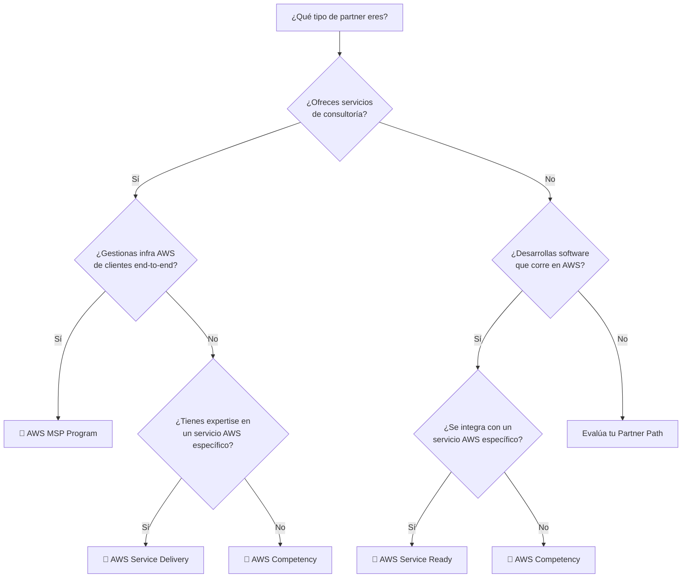
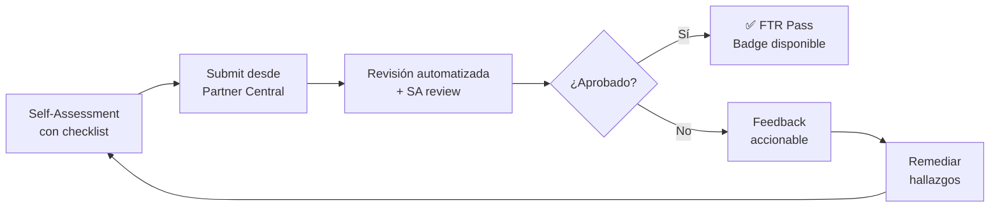
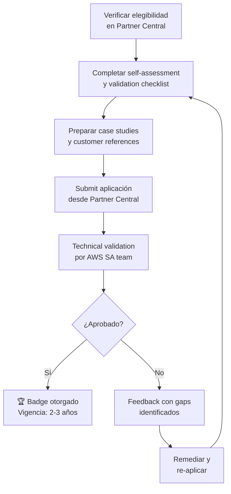
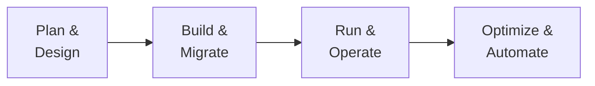
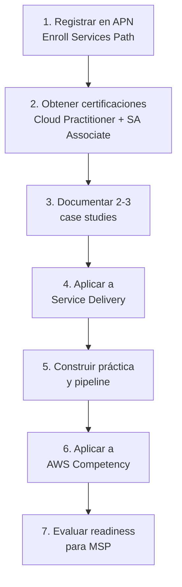
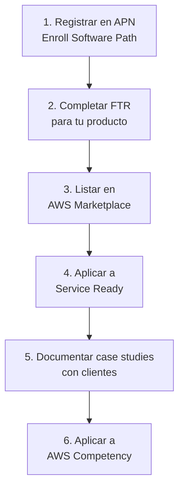

# 🏅 AWS Competencias y Especializaciones — Guía para obtener badges de AWS

## 📋 Introducción

Las **AWS Specializations** son programas de diferenciación que validan la experiencia técnica y el éxito con clientes de los AWS Partners. Obtener un badge demuestra que tu organización ha pasado una validación técnica rigurosa y sigue las mejores prácticas de AWS.

:::info ¿Por qué obtener una especialización?
Los badges de AWS aumentan tu visibilidad en el [AWS Partner Solutions Finder](https://partners.amazonaws.com/), generan confianza en clientes que buscan partners validados, desbloquean beneficios de co-sell y funding, y fortalecen tu posición competitiva en el ecosistema.
:::

### Tipos de Especializaciones

AWS ofrece cuatro programas principales de especialización:

| Programa | Dirigido a | Qué valida |
|:---|:---|:---|
| **AWS Competency** | Services Partners e ISVs | Expertise profunda en una industria o caso de uso |
| **AWS Service Delivery** | Services Partners (Consulting) | Experiencia entregando un servicio AWS específico |
| **AWS Service Ready** | Technology Partners (ISVs) | Integración técnica validada con un servicio AWS |
| **AWS MSP** | Managed Service Providers | Capacidad end-to-end de gestión de workloads AWS |

---

## 🗂️ Partner Paths: El Punto de Partida

Antes de aplicar a cualquier especialización, debes estar registrado en AWS Partner Network (APN) y enrollado en un **Partner Path**. Los paths disponibles son:

| Path | Para quién | Ejemplos |
|:---|:---|:---|
| **Software Path** | ISVs que desarrollan software en AWS | SaaS, AMI, containers |
| **Services Path** | Consultoras y system integrators | Migración, implementación, managed services |
| **Hardware Path** | Fabricantes de hardware compatible | Dispositivos IoT, appliances |
| **Training Path** | Organizaciones de capacitación | Training delivery, contenido educativo |
| **Distribution Path** | Distribuidores y resellers | Reventa de servicios AWS |

:::tip Enrollment gratuito
Unirse a APN y enrollar en cualquier Partner Path es **gratuito**. Lo haces desde [AWS Partner Central](https://partnercentral.awspartner.com). No necesitas pagar para comenzar tu journey.
:::

---

## 🔑 Prerequisito Fundamental: AWS FTR

El **Foundational Technical Review (FTR)** es el primer checkpoint técnico que todo partner debe completar antes de acceder a especializaciones avanzadas.

### ¿Qué es el FTR?

El FTR evalúa tu solución contra un subconjunto de mejores prácticas del AWS Well-Architected Framework. Se enfoca en:

- **Security** — cifrado, gestión de acceso, protección de datos
- **Reliability** — resiliencia, backup, recovery
- **Operational Excellence** — monitoreo, logging, incident response
- **Performance Efficiency** — uso adecuado de recursos

### Proceso del FTR

### Requisitos del FTR por tipo de solución

<strong>Partner Hosted (corriendo en AWS)</strong>

- Infraestructura multi-AZ o justificación de single-AZ
- Cifrado en reposo y en tránsito
- Logging centralizado (CloudTrail, CloudWatch)
- IAM roles con least privilege
- Backup automatizado y recovery plan testeado
- Vulnerability scanning periódico
- Incident response plan documentado

<strong>Partner Hosted (fuera de AWS)</strong>

- Certificación de seguridad reconocida (SOC 2, ISO 27001, etc.)
- Evidencia de prácticas de seguridad equivalentes
- Documentación de la arquitectura de integración con AWS

<strong>Customer Deployed (en cuenta del cliente)</strong>

- Templates de IaC que siguen best practices (CloudFormation, CDK, Terraform)
- Documentación de despliegue detallada
- Uso de IAM roles (no access keys hardcodeadas)
- Cifrado por defecto en todos los recursos
- Guía de operación y troubleshooting

:::info FTR Streamlined
Desde 2024, AWS acepta certificaciones estándar de la industria (SOC 2, ISO 27001) como validación equivalente para el FTR, reduciendo significativamente el tiempo de aprobación. La revisión puede devolver resultado en minutos.
:::

---

## 🏆 AWS Competency Program

El programa de **AWS Competency** es el badge de mayor nivel que valida expertise profunda en una industria vertical o caso de uso horizontal.

### Categorías de Competency disponibles

#### Por Industria (Vertical)

| Competency | Enfoque |
|:---|:---|
| **Financial Services** | Banking, insurance, capital markets |
| **Healthcare** | Life sciences, health IT, genomics |
| **Government** | Public sector, defense, intelligence |
| **Energy** | Oil & gas, utilities, renewables |
| **Retail** | Commerce, supply chain |
| **Media & Entertainment** | Streaming, content creation |
| **Travel & Hospitality** | Booking, loyalty, operations |
| **Education** | EdTech, learning management |

#### Por Caso de Uso (Horizontal)

| Competency | Enfoque |
|:---|:---|
| **Migration & Modernization** | Migración a la nube y modernización de apps |
| **Security** | Threat detection, IAM, data protection, compliance |
| **DevOps** | CI/CD, infrastructure as code, observability |
| **Data & Analytics** | Data lakes, BI, big data processing |
| **Machine Learning** | ML frameworks, MLOps, computer vision |
| **Generative AI** | LLMs, agentic AI, foundation models |
| **Networking** | Connectivity, CDN, hybrid networking |
| **Storage** | Backup, archive, file systems |
| **IoT** | Edge computing, device management |
| **MSSP** | Managed Security Service Provider |

:::tip Nuevas categorías en 2025-2026
AWS ha expandido significativamente la AI Competency con categorías de **Agentic AI**, y la Security Competency ahora incluye 8 subcategorías especializadas. Revisa periódicamente las actualizaciones.
:::

### Requisitos para AWS Competency

Los requisitos varían por categoría, pero en general incluyen:

| Requisito | Detalle |
|:---|:---|
| **Partner Path** | Enrollado en Software Path o Services Path |
| **FTR** | Aprobado para al menos una solución |
| **Case Studies** | Mínimo 2-5 casos de éxito documentados con clientes |
| **Technical Validation** | Revisión por AWS Partner Solutions Architect |
| **AWS Certifications** | Número mínimo de profesionales certificados |
| **Customer References** | Referencias verificables de clientes satisfechos |
| **Revenue/Practice** | Demostrar práctica activa con revenue en el área |

### Proceso de aplicación

:::caution Renovación obligatoria
Las Competencies requieren **renovación cada 2-3 años** (dependiendo de la categoría). Si no renuevas, pierdes el badge y la visibilidad asociada. Mantén tus case studies y certificaciones actualizadas.
:::

---

## 🔧 AWS Service Delivery Program

El programa **Service Delivery** valida que un partner de servicios tiene experiencia técnica profunda entregando un servicio AWS específico a clientes.

### Ejemplos de Service Delivery Designations

| Servicio | Qué valida |
|:---|:---|
| **Amazon ECS** | Expertise en containerización y orquestación |
| **Amazon Aurora** | Migración y gestión de bases de datos Aurora |
| **AWS Lambda** | Arquitecturas serverless en producción |
| **Amazon Connect** | Contact centers en la nube |
| **AWS Control Tower** | Landing zones y governance multi-account |
| **Amazon Bedrock** | Implementación de modelos de IA generativa |
| **AWS Database Migration Service** | Migraciones de bases de datos |
| **Amazon EKS** | Kubernetes gestión y operación |

### Requisitos de Service Delivery

| Requisito | Detalle |
|:---|:---|
| **Partner Path** | Services Path enrollado |
| **FTR** | No siempre requerido (depende de la designation) |
| **Case Studies** | 2-3 proyectos exitosos documentados con el servicio específico |
| **Technical Validation** | Revisión detallada por AWS SA |
| **Certified Professionals** | Profesionales con certificación relevante |
| **Architecture Review** | Documentación de arquitecturas implementadas |
| **Best Practices** | Evidencia de seguir Well-Architected en implementaciones |

### Validation Checklist

Cada Service Delivery designation tiene un checklist público que detalla los criterios exactos. El proceso incluye:

1. **Revisión de arquitectura** — El SA de AWS revisa la arquitectura de las soluciones entregadas
2. **Documentación de cliente** — Case studies detallados con métricas de éxito
3. **Customer references** — Clientes dispuestos a confirmar la experiencia del partner
4. **Prácticas operativas** — Evidencia de monitoring, alerting y operational procedures

:::tip Dónde encontrar los checklists
Los validation checklists actualizados están disponibles en [AWS Partner Central](https://partnercentral.awspartner.com) bajo la sección de programas, y también en el [blog de APN](https://aws.amazon.com/blogs/apn/updated-validation-checklists-for-aws-specialization-programs/).
:::

---

## 💻 AWS Service Ready Program

El programa **Service Ready** está diseñado para **ISVs (Technology Partners)** cuyo software se integra con un servicio AWS específico.

### Diferencia clave con Service Delivery

| Aspecto | Service Delivery | Service Ready |
|:---|:---|:---|
| **Para quién** | Services Partners (consultoras) | Technology Partners (ISVs) |
| **Qué valida** | Experiencia entregando el servicio | Integración técnica del producto |
| **Enfoque** | Proyectos de clientes | Producto de software |
| **Prerequisito** | Services Path | Software Path + FTR |

### Ejemplos de Service Ready Designations

- **Amazon S3 Ready** — Producto integrado nativamente con S3
- **Amazon RDS Ready** — Software optimizado para RDS
- **AWS Graviton Ready** — Software validado en procesadores Graviton
- **Amazon Security Lake Ready** — Integración con Security Lake
- **AWS PrivateLink Ready** — Conectividad privada implementada
- **Amazon Bedrock Ready** — Integración con modelos de IA generativa

### Requisitos de Service Ready

1. ✅ Enrollado en **Software Path**
2. ✅ **FTR aprobado** para el producto
3. ✅ Integración técnica validada con el servicio AWS específico
4. ✅ Documentación de la integración
5. ✅ Listing activo en AWS Marketplace (recomendado)
6. ✅ Validación por AWS SA del equipo del servicio

---

## 🛡️ AWS MSP Program

El programa **Managed Service Provider (MSP)** es el más exigente de todos. Valida que un partner puede gestionar workloads AWS de clientes de forma integral.

### Qué cubre el MSP

El MSP Program valida capacidad en todo el lifecycle:

### Proceso de validación MSP

A diferencia de las otras especializaciones, el MSP requiere una **auditoría independiente de terceros**:

| Fase | Descripción | Duración |
|:---|:---|:---|
| **Pre-Assessment** | Self-assessment contra el checklist v5 | 2-4 semanas |
| **Gap Remediation** | Cerrar gaps identificados | 1-6 meses |
| **Full Audit** | Auditoría por tercero independiente | 4-6 semanas |
| **AWS Review** | Revisión final por AWS | 2-4 semanas |

### Dominios evaluados en el MSP

<strong>Planning & Design</strong>

- Cloud strategy y roadmap
- Well-Architected Reviews
- Migration planning (6 Rs)
- Total Cost of Ownership (TCO) analysis
- Security y compliance planning

<strong>Build & Migrate</strong>

- Landing zone setup (Control Tower, Organizations)
- Infrastructure as Code
- Migration execution
- Application modernization
- Data migration

<strong>Run & Operate</strong>

- 24/7 monitoring y alerting
- Incident management y escalation
- Change management
- Patch management
- Backup y disaster recovery

<strong>Optimize & Automate</strong>

- Cost optimization y FinOps
- Performance tuning
- Automation de operaciones
- Continuous improvement
- Security posture management

:::warning Nivel de esfuerzo
Obtener el MSP badge típicamente requiere **6-12 meses** de preparación. Es la validación más completa del ecosistema y demuestra madurez operacional de clase enterprise.
:::

---

## 📋 Guía Práctica: Tu Roadmap hacia la Especialización

### Para Services Partners (Consultoras)

### Para ISVs (Technology Partners)

### Timeline realista

| Milestone | Services Partner | ISV |
|:---|:---|:---|
| APN Registration + Path | Semana 1 | Semana 1 |
| Certificaciones base | Mes 1-2 | Mes 1-2 |
| FTR (ISVs) | N/A | Mes 2-3 |
| Marketplace Listing | Opcional | Mes 3-4 |
| Primera especialización | Mes 4-6 | Mes 4-6 |
| Competency | Mes 9-18 | Mes 9-18 |
| MSP (si aplica) | Mes 12-24 | N/A |

---

## 💡 Best Practices y Consejos

### Preparación de Case Studies

Un buen case study para la validación debe incluir:

- **Contexto del cliente** — industria, tamaño, desafío de negocio
- **Solución implementada** — servicios AWS usados, arquitectura (diagrama)
- **Resultados medibles** — métricas de antes/después (costo, performance, time-to-market)
- **Lecciones aprendidas** — qué harías diferente
- **Referencia del cliente** — contacto dispuesto a validar (nombre, rol, empresa)

:::tip Formato recomendado
AWS proporciona templates de case study en Partner Central. Úsalos para asegurar que cubres todos los puntos que el SA reviewer evaluará.
:::

### Certificaciones recomendadas

| Especialización | Certificaciones sugeridas |
|:---|:---|
| Cualquiera (base) | AWS Cloud Practitioner + Solutions Architect Associate |
| Migration | SA Professional + Migration Specialty |
| Security | Security Specialty + SA Professional |
| Data & Analytics | Data Analytics Specialty |
| Machine Learning / AI | ML Specialty + AI Practitioner |
| DevOps | DevOps Professional |
| Networking | Advanced Networking Specialty |

### Errores comunes a evitar

- ❌ **Aplicar sin case studies listos** — es la causa #1 de rechazo
- ❌ **No tener customer references disponibles** — coordina con tus clientes antes de aplicar
- ❌ **Documentación incompleta** — sigue el validation checklist al pie de la letra
- ❌ **Ignorar el FTR** — es prerequisito para ISVs y acelera Service Delivery
- ❌ **No renovar a tiempo** — pon recordatorios 3 meses antes del vencimiento
- ❌ **Aplicar a demasiadas a la vez** — es mejor enfocarse y construir momentum

---

## 🎯 Beneficios de las Especializaciones

| Beneficio | Detalle |
|:---|:---|
| **Visibilidad** | Badge visible en Partner Solutions Finder y tu partner profile |
| **Co-sell** | Acceso a referrals de AWS sales teams para deals del área |
| **Funding** | Elegibilidad a programas de funding (MDF, PoC credits, etc.) |
| **Go-to-Market** | Inclusión en campañas de marketing de AWS |
| **Credibilidad** | Diferenciación competitiva validada por AWS |
| **AWS Support** | Acceso a Partner SA y account teams dedicados |
| **Events** | Invitaciones a eventos exclusivos de partners |

---

## ❓ Preguntas Frecuentes

<strong>¿Cuánto cuesta obtener una especialización?</strong>

Registrarse en APN y aplicar a especializaciones **no tiene costo directo**. Sin embargo, hay costos indirectos: tiempo de tu equipo para preparar documentación, obtener certificaciones, y pasar por la validación. Para el MSP, la auditoría de terceros tiene un costo que varía por auditor (típicamente $15,000-$50,000 USD).

<strong>¿Puedo tener múltiples especializaciones simultáneamente?</strong>

Sí. De hecho, AWS recomienda acumular especializaciones a medida que creces. Puedes tener múltiples Service Delivery designations, Service Ready designations y Competencies al mismo tiempo. Cada una requiere su propia renovación.

<strong>¿Cuánto tarda el proceso de validación?</strong>

- **FTR:** Minutos a días (con certificaciones aceptadas, puede ser inmediato)
- **Service Ready:** 4-8 semanas
- **Service Delivery:** 6-12 semanas
- **Competency:** 8-16 semanas
- **MSP:** 3-6 meses (incluyendo auditoría)

<strong>¿Qué pasa si me rechazan la aplicación?</strong>

AWS proporciona feedback detallado con los gaps identificados. Puedes remediar y re-aplicar. No hay penalización por re-aplicar. El feedback típicamente incluye qué falta en tu documentación, case studies o capacidades técnicas.

<strong>¿El FTR es obligatorio para Services Partners?</strong>

No siempre. El FTR es obligatorio para ISVs (Software Path) que quieren acceder a Service Ready o co-sell. Para Services Partners, depende de la especialización específica. Sin embargo, completar un FTR para tus soluciones siempre suma credibilidad.

<strong>¿Cómo sé cuál especialización priorizar?</strong>

Prioriza basándote en: (1) dónde tienes la mayor cantidad de experiencia demostrable, (2) dónde tienes case studies y customer references listos, y (3) qué se alinea con tu estrategia de go-to-market. Empieza por la más fácil de evidenciar y construye desde ahí.

<strong>¿Mi partner manager de AWS puede ayudarme?</strong>

Sí. Tu AWS Partner Manager (PDM/PSA) puede orientarte sobre qué especialización perseguir, conectarte con el SA que hará la validación, y darte visibilidad de los requisitos específicos. Agendar una sesión de planning con ellos es altamente recomendado.

---

## 📚 Recursos Adicionales

- 📖 [AWS Specializations Overview](https://aws.amazon.com/partners/programs/specializations/)
- 🏆 [AWS Competency Program](https://aws.amazon.com/partners/programs/competencies/)
- 🔧 [AWS Service Delivery Program](https://aws.amazon.com/partners/offerings/service-delivery/)
- 💻 [AWS Service Ready Program](https://aws.amazon.com/partners/programs/service-ready/)
- 🛡️ [AWS MSP Program](https://aws.amazon.com/partners/programs/msp/)
- 📋 [Validation Checklists actualizados](https://aws.amazon.com/blogs/apn/updated-validation-checklists-for-aws-specialization-programs/)
- 🔑 [AWS Foundational Technical Review](https://aws.amazon.com/partners/foundational-technical-review/)
- 🗺️ [AWS Partner Paths](https://aws.amazon.com/partners/paths/)
- 🔍 [AWS Partner Solutions Finder](https://partners.amazonaws.com/)
- 🤖 [AI de Onboarding en Partner Central](https://docs.aws.amazon.com/partner-central/latest/getting-started/partner-onboarding-agent.html)

---

*Guía creada por el equipo de AWS Solution Architects — Cloud Architect Library*
