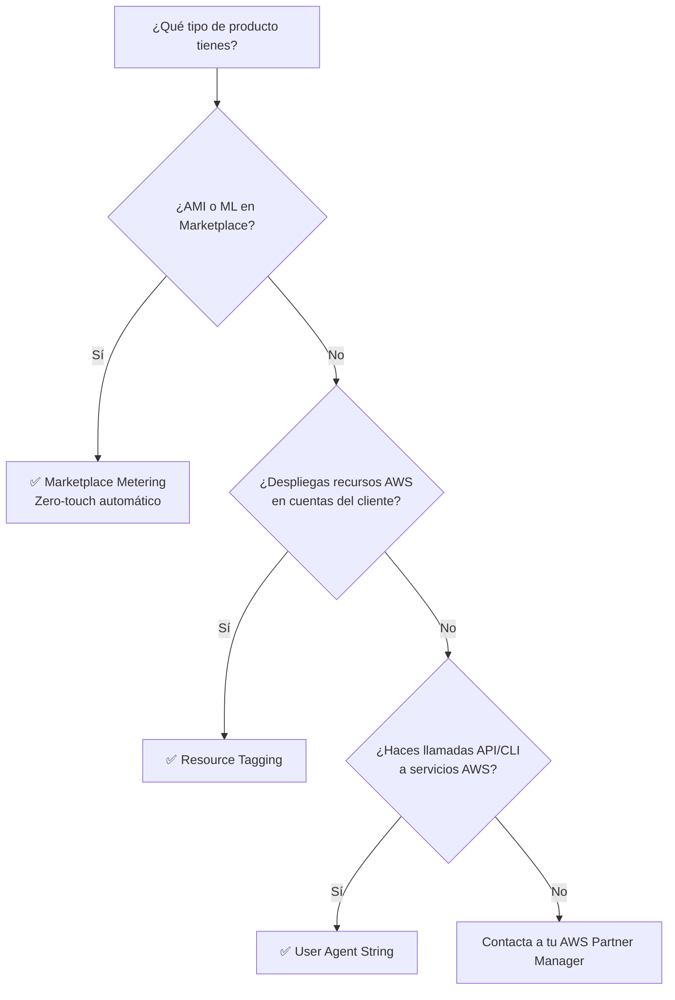
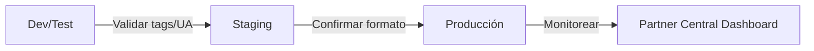

<div align="center">

# 📊 AWS Partner Revenue Measurement (PRM) — Guía de Onboarding


</div>

## 📋 Introducción

**Partner Revenue Measurement (PRM)** es un conjunto de capacidades que permite a los AWS Partners medir el consumo de servicios AWS generado por sus soluciones y cuantificar su impacto en los ingresos de AWS. Esto habilita a AWS para atribuir ingresos a las soluciones de los partners y proporcionar datos agregados de consumo de vuelta a los partners.

:::info ¿Por qué implementar PRM?
PRM permite a los partners demostrar el valor de sus soluciones, desbloquear oportunidades de co-inversión con AWS, acceder al dashboard de **Attributed Revenue** en Partner Central, y fortalecer la relación comercial con AWS.
:::

### Métodos de Implementación

PRM soporta tres métodos de implementación. Elige el que mejor se adapte a tu tipo de producto y arquitectura:

| Método | Caso de Uso | Esfuerzo |
|:---|:---|:---|
| **AWS Marketplace Metering** | Productos AMI y ML listados en Marketplace | Zero-touch (automático) |
| **Resource Tagging** | Productos que despliegan recursos AWS en cuentas propias o del cliente | Medio |
| **User Agent String** | Productos que realizan llamadas API/CLI a AWS regularmente | Bajo |

:::tip Combinación de métodos
Puedes implementar múltiples métodos simultáneamente. Por ejemplo, un producto AMI puede beneficiarse de Marketplace Metering para atribución EC2 y User Agent String para atribución en servicios AWS adicionales.
:::

---

## ✅ Prerequisitos

Antes de iniciar la implementación de PRM, asegúrate de cumplir con los siguientes requisitos:

### 1. Cuenta en AWS Partner Central

- ✅ Tener una cuenta activa en [AWS Partner Central](https://partnercentral.awspartner.com)
- ✅ Haber migrado a la nueva experiencia de Partner Central
- ✅ Vincular tu cuenta de AWS Partner Central con tu AWS Account ID

:::note Vinculación de cuentas
AWS recomienda crear y vincular una nueva cuenta AWS que represente tu negocio global, luego conectar todas las cuentas individuales de AWS Marketplace usando **Subsidiary Account Connections** (accesible solo después de migrar a la nueva experiencia de Partner Central).
:::

### 2. Listing en AWS Marketplace

- ✅ Tener al menos un producto listado en [AWS Marketplace](https://aws.amazon.com/marketplace)
- ✅ Tener acceso al [AWS Marketplace Management Portal](https://aws.amazon.com/marketplace/management)
- ✅ Conocer tu **Product Code** (código alfanumérico que identifica tu producto)

#### ¿Cómo obtener tu Product Code?

1. Inicia sesión en el [AWS Marketplace Management Portal](https://aws.amazon.com/marketplace/management)
2. Navega a la página de **Products**
3. Selecciona tu producto
4. Encuentra el product code en la sección **Product Summary**

El formato del product code es una cadena alfanumérica, por ejemplo: `5ugbbrmu7ud3u5hsipfzug61p`

### 3. Requisitos por Método

<details>
<summary><strong>Marketplace Metering</strong></summary>

- Cuenta de AWS Partner Central vinculada con tu AWS Account ID
- Producto listado en AWS Marketplace de tipo **AMI** o **Machine Learning (ML)** únicamente
- No requiere implementación adicional — la atribución ocurre automáticamente

</details>

<details>
<summary><strong>Resource Tagging</strong></summary>

- Capacidad de aplicar tags a recursos AWS en tu propia cuenta o en la cuenta del cliente
- Producto que utiliza uno o más de los servicios AWS soportados para resource tagging
- Conocer el formato de tag: key `aws-apn-id` con value `pc:<product-code>`

</details>

<details>
<summary><strong>User Agent String</strong></summary>

- Producto que realiza llamadas regulares a la API/CLI de AWS
- Capacidad de modificar el User Agent en las llamadas del AWS SDK
- Conocer el formato: `APN_1.1/pc_<YOUR-PRODUCT-CODE>$`
- **Requisito operativo:** tu producto debe ejecutar al menos una operación API sobre un recurso al mes para que ese período contribuya a la atribución

</details>

### 4. Preguntas Clave antes de Iniciar

Responde estas preguntas para determinar tu método óptimo:

- ¿Qué servicios AWS utiliza tu producto (EC2, S3, ECS, RDS, Bedrock)?
- ¿Tienes un producto SaaS, AMI, ML o Professional Services listado en AWS Marketplace?
- ¿Tu producto despliega recursos directamente en las cuentas de los clientes?
- ¿Tu producto hace llamadas API/CLI a servicios AWS regularmente?

---

## 🚀 Paso 1: Seleccionar el Método de Implementación

### Árbol de Decisión



### Marketplace Metering (Zero-Touch)

Si tu producto es de tipo **AMI** o **ML** listado en AWS Marketplace, la atribución de ingresos ocurre automáticamente a través de los metadatos del producto existente. **No requiere implementación adicional.**

Cuando un cliente compra y utiliza tu producto AMI/ML, AWS Marketplace asigna automáticamente un product code único que permite la medición.

### Resource Tagging

Ideal cuando tu producto despliega o gestiona recursos AWS. Los recursos se etiquetan con el identificador de tu producto para atribución de ingresos.

**Formato del tag:**
```
Key:   aws-apn-id
Value: pc:<tu-product-code>
```

**Ejemplo:**
```
Key:   aws-apn-id
Value: pc:5ugbbrmu7ud3u5hsipfzug61p
```

:::caution Limitación importante
Un recurso AWS solo puede tener un tag con la key `aws-apn-id`. Solo se permite un identificador de partner por recurso. Para escenarios multi-partner donde múltiples partners operan sobre el mismo recurso, considera usar el método de User Agent String.
:::

### User Agent String

Ideal para productos SaaS que hacen llamadas API regulares a servicios AWS. Incluye una cadena de User Agent en todas las llamadas.

**Formato:**
```
APN_1.1/pc_<YOUR-PRODUCT-CODE>$
```

**Ejemplo:**
```
APN_1.1/pc_5ugbbrmu7ud3u5hsipfzug61p$
```

> El símbolo `$` al final es el delimitador obligatorio.

---

## 🛠️ Paso 2: Implementar la Solución

### Opción A: Resource Tagging

#### Tagging Manual (Consola AWS)

1. Navega al servicio AWS correspondiente (ej: EC2, S3, RDS)
2. Selecciona el recurso
3. Ve a la pestaña **Tags**
4. Añade un nuevo tag:
   - **Key:** `aws-apn-id`
   - **Value:** `pc:<tu-product-code>`

:::warning Drift en IaC
Si el recurso es gestionado por Infrastructure as Code (CloudFormation, Terraform, CDK), aplicar tags vía consola causará drift detection en la próxima ejecución del IaC. Para recursos gestionados por IaC, siempre aplica los tags a través de la herramienta IaC.
:::

#### Tagging Automatizado (Recomendado)

AWS recomienda automatizar el tagging tanto como sea posible usando las siguientes herramientas:

**AWS CloudFormation:**
```yaml
Resources:
  MyEC2Instance:
    Type: AWS::EC2::Instance
    Properties:
      InstanceType: t3.micro
      ImageId: ami-0abcdef1234567890
      Tags:
        - Key: aws-apn-id
          Value: "pc:5ugbbrmu7ud3u5hsipfzug61p"
        - Key: Name
          Value: "partner-managed-instance"
```

**AWS CDK (TypeScript):**
```typescript
import * as ec2 from 'aws-cdk-lib/aws-ec2';
import { Tags } from 'aws-cdk-lib';

const instance = new ec2.Instance(this, 'MyInstance', {
  instanceType: ec2.InstanceType.of(ec2.InstanceClass.T3, ec2.InstanceSize.MICRO),
  machineImage: ec2.MachineImage.latestAmazonLinux2(),
  vpc,
});

Tags.of(instance).add('aws-apn-id', 'pc:5ugbbrmu7ud3u5hsipfzug61p');
```

**Terraform:**
```hcl
resource "aws_instance" "partner_managed" {
  ami           = "ami-0abcdef1234567890"
  instance_type = "t3.micro"

  tags = {
    "aws-apn-id" = "pc:5ugbbrmu7ud3u5hsipfzug61p"
    "Name"       = "partner-managed-instance"
  }
}
```

**AWS Tag Editor (Tagging masivo):**
```bash
aws resourcegroupstaggingapi tag-resources \
  --resource-arn-list \
    "arn:aws:ec2:us-east-1:123456789012:instance/i-1234567890abcdef0" \
    "arn:aws:ec2:us-east-1:123456789012:instance/i-0987654321fedcba0" \
  --tags aws-apn-id=pc:5ugbbrmu7ud3u5hsipfzug61p
```

#### Caso Especial: Amazon Bedrock

Amazon Bedrock utiliza **application inference profiles** como recurso tageable para PRM. Debes:

1. Crear un application inference profile
2. Aplicar el tag `aws-apn-id` al profile
3. Usar ese profile para todas las invocaciones del modelo

```bash
# Crear inference profile y aplicar tag
aws bedrock create-inference-profile \
  --inference-profile-name "partner-profile" \
  --model-source '{"copyFrom": "arn:aws:bedrock:us-east-1::foundation-model/anthropic.claude-3-sonnet-20240229-v1:0"}'

aws bedrock tag-resource \
  --resource-arn "arn:aws:bedrock:us-east-1:123456789012:inference-profile/partner-profile" \
  --tags key=aws-apn-id,value=pc:5ugbbrmu7ud3u5hsipfzug61p
```

---

### Opción B: User Agent String

#### Implementación Manual

Incluye el User Agent string en cada llamada individual al SDK de AWS.

:::caution Requisito operativo
Para que la atribución por User Agent sea efectiva, tu producto debe ejecutar **al menos una operación API sobre un recurso al mes**. Si no hay operaciones en un mes dado, ese período no contribuirá a la atribución de ingresos.
:::

**Python (Boto3):**
```python
import boto3
from botocore.config import Config

UA_STRING = "APN_1.1/pc_5ugbbrmu7ud3u5hsipfzug61p$"

# Usar user_agent_extra para AÑADIR el identificador PRM al User Agent existente.
# ⚠️ No uses user_agent (sin _extra), ya que reemplaza el header completo
# y elimina la metadata del SDK que AWS necesita para procesar la atribución.
session_config = Config(user_agent_extra=UA_STRING)

# Cliente EC2
ec2 = boto3.client('ec2', config=session_config)

# Cliente S3
s3 = boto3.client('s3', config=session_config)

# Ejemplo: listar instancias con atribución PRM
response = ec2.describe_instances()
```

**Java (AWS SDK v2):**
```java
import software.amazon.awssdk.core.client.config.ClientOverrideConfiguration;
import software.amazon.awssdk.core.client.config.SdkAdvancedClientOption;
import software.amazon.awssdk.services.ec2.Ec2Client;
import software.amazon.awssdk.services.s3.S3Client;

public class PrmExample {
    private static final String UA_STRING = "APN_1.1/pc_5ugbbrmu7ud3u5hsipfzug61p$";

    public static void main(String[] args) {
        ClientOverrideConfiguration config = ClientOverrideConfiguration.builder()
            .putAdvancedOption(SdkAdvancedClientOption.USER_AGENT_SUFFIX, UA_STRING)
            .build();

        Ec2Client ec2 = Ec2Client.builder()
            .overrideConfiguration(config)
            .build();

        S3Client s3 = S3Client.builder()
            .overrideConfiguration(config)
            .build();
    }
}
```

**Node.js (AWS SDK v3):**
```javascript
import { EC2Client, DescribeInstancesCommand } from "@aws-sdk/client-ec2";

const UA_STRING = "APN_1.1/pc_5ugbbrmu7ud3u5hsipfzug61p$";

const ec2Client = new EC2Client({
  customUserAgent: UA_STRING,
});

const response = await ec2Client.send(new DescribeInstancesCommand({}));
```

#### Implementación Automatizada (Recomendado)

Para soluciones que hacen múltiples llamadas API/CLI, puedes automatizar la inclusión del User Agent a nivel de sesión o proceso en lugar de instrumentar cada llamada individualmente.

:::warning Nota sobre `AWS_SDK_UA_APP_ID` / `sdk_ua_app_id`
Algunos SDKs emiten el Application ID con el prefijo `app/` y restringen caracteres especiales (como `/` y `$`), lo que puede alterar el formato PRM requerido. **Se recomienda usar los mecanismos de "user agent extra/suffix" nativos de cada SDK** que se muestran a continuación.
:::

**Python (Boto3) — Configuración global de sesión:**
```python
import boto3
from botocore.config import Config

UA_STRING = "APN_1.1/pc_5ugbbrmu7ud3u5hsipfzug61p$"

# Configurar una vez a nivel de sesión
session = boto3.Session()
prm_config = Config(user_agent_extra=UA_STRING)

# Todos los clientes creados desde esta config heredan el User Agent
ec2 = session.client('ec2', config=prm_config)
s3 = session.client('s3', config=prm_config)
bedrock = session.client('bedrock-runtime', config=prm_config)
```

**Java (AWS SDK v2) — Suffix global:**
```java
import software.amazon.awssdk.core.client.config.ClientOverrideConfiguration;
import software.amazon.awssdk.core.client.config.SdkAdvancedClientOption;

private static final String UA_STRING = "APN_1.1/pc_5ugbbrmu7ud3u5hsipfzug61p$";

// Configuración reutilizable para todos los clientes
ClientOverrideConfiguration prmConfig = ClientOverrideConfiguration.builder()
    .putAdvancedOption(SdkAdvancedClientOption.USER_AGENT_SUFFIX, UA_STRING)
    .build();

Ec2Client ec2 = Ec2Client.builder().overrideConfiguration(prmConfig).build();
S3Client s3 = S3Client.builder().overrideConfiguration(prmConfig).build();
```

**Node.js (AWS SDK v3) — Custom User Agent:**
```javascript
import { EC2Client } from "@aws-sdk/client-ec2";
import { S3Client } from "@aws-sdk/client-s3";

const UA_STRING = "APN_1.1/pc_5ugbbrmu7ud3u5hsipfzug61p$";

// customUserAgent añade el string como suffix sin alterar el formato
const ec2 = new EC2Client({ customUserAgent: UA_STRING });
const s3 = new S3Client({ customUserAgent: UA_STRING });
```

**Go (AWS SDK v2):**
```go
import (
    "github.com/aws/aws-sdk-go-v2/aws"
    "github.com/aws/aws-sdk-go-v2/config"
)

cfg, _ := config.LoadDefaultConfig(context.TODO(),
    config.WithAPIOptions(
        middleware.AddUserAgentKeyValue("APN_1.1/pc_5ugbbrmu7ud3u5hsipfzug61p$", ""),
    ),
)
```

**CLI — Variable de entorno (para scripts y pipelines):**
```bash
# Funciona con AWS CLI v2 — se añade al User Agent de cada comando
export AWS_EXECUTION_ENV="APN_1.1/pc_5ugbbrmu7ud3u5hsipfzug61p$"
```

:::tip Cobertura de servicios
AWS PRM tiene la intención de soportar todos los servicios AWS. Se recomienda instrumentar PRM en todos los servicios y recursos con los que tu solución interactúa, para evitar cambios operacionales continuos a medida que la cobertura de servicios se expande.
:::

:::caution Exclusiones y limitaciones por servicio
No todos los servicios atribuyen ingresos de la misma forma. Por ejemplo, para S3 la atribución puede cubrir solo costos de almacenamiento y no de requests, y algunos servicios tienen exclusiones específicas. **Antes de estimar revenue**, verifica la cobertura exacta de cada servicio:

- 📋 [Servicios soportados para Resource Tagging](https://docs.aws.amazon.com/PRM/latest/aws-prm-onboarding-guide/resource-tagging-included-services.html)
- 📋 [Servicios soportados para User Agent String](https://docs.aws.amazon.com/PRM/latest/aws-prm-onboarding-guide/user-agent-included-services.html)

Revisa estas listas periódicamente ya que AWS las actualiza a medida que añade nuevos servicios.
:::

---

## ✔️ Paso 3: Validar y Monitorear

### 1. Validar la Implementación

#### Para Resource Tagging

Verifica que tus tags están correctamente aplicados:

```bash
# Verificar tags en un recurso específico
aws ec2 describe-tags \
  --filters "Name=resource-id,Values=i-1234567890abcdef0" \
            "Name=key,Values=aws-apn-id"
```

**Resultado esperado:**
```json
{
  "Tags": [
    {
      "Key": "aws-apn-id",
      "Value": "pc:5ugbbrmu7ud3u5hsipfzug61p",
      "ResourceId": "i-1234567890abcdef0",
      "ResourceType": "instance"
    }
  ]
}
```

**Checklist de validación:**
- [ ] El tag key es exactamente `aws-apn-id` (case-sensitive)
- [ ] El tag value sigue el formato `pc:<product-code>`
- [ ] El product code corresponde a tu producto en Marketplace
- [ ] El tag no excede el límite de 50 tags por recurso
- [ ] No hay conflicto con otro partner tag en el mismo recurso

#### Para User Agent String

Verifica que el User Agent se incluye correctamente en las llamadas:

```bash
# Activar debug logging para verificar el User Agent
aws ec2 describe-instances --debug 2>&1 | grep -i "user-agent"
```

**Checklist de validación:**
- [ ] El formato es exactamente `APN_1.1/pc_<PRODUCT-CODE>$`
- [ ] El delimitador `$` está presente al final
- [ ] El product code es correcto y alfanumérico
- [ ] El User Agent se incluye en todas las llamadas API relevantes
- [ ] Tu producto ejecuta al menos una operación API al mes por recurso (requisito para que la atribución sea efectiva)

### 2. Entornos de Prueba

:::info Nota sobre entornos
PRM está diseñado para medir workloads de producción. Los entornos de dev/test/staging pueden usarse para validar tu implementación antes de desplegar en producción.
:::

**Flujo recomendado:**



### 3. Contactar a tu AWS Partner Team

Una vez desplegado en producción:

1. Contacta a tu **AWS Partner Management team** o abre un caso en [APN Support](https://partnercentral.awspartner.com) (requiere login en Partner Central)
2. Proporciona los detalles de tu implementación:
   - Método utilizado (Resource Tagging / User Agent / ambos)
   - Product code
   - Servicios AWS involucrados
   - Región(es) de despliegue
3. AWS validará que la atribución de ingresos funciona correctamente

### 4. Monitorear en Partner Central

Una vez validado, accede al **Attributed Revenue Dashboard** en AWS Partner Central:

- 📊 Visualiza ingresos atribuidos mensuales por producto
- 📈 Desglosa por servicio AWS y período de facturación
- 📋 Descarga reportes de consumo agregado

:::warning Latencia de datos
El dashboard de Attributed Revenue actualiza los datos aproximadamente **45 días después del cierre del mes de facturación**. No esperes ver resultados inmediatos tras desplegar tu implementación. Planifica al menos 2 meses desde el go-live en producción para poder validar datos reales en el dashboard.
:::

---

## 🎥 Demos Interactivas

AWS proporciona demos interactivas click-through que te guían a través de los pasos de implementación de PRM sin necesidad de acceso a un entorno AWS real:

🔗 [Explorar demos interactivas de PRM](https://docs.aws.amazon.com/PRM/latest/aws-prm-onboarding-guide/demo.html)

---

## ❓ Preguntas Frecuentes

<details>
<summary><strong>¿Puedo usar múltiples métodos de PRM simultáneamente?</strong></summary>

Sí. Puedes combinar métodos. Por ejemplo, un producto AMI puede usar Marketplace Metering para atribución de EC2 y User Agent String para servicios adicionales como S3 o DynamoDB.

</details>

<details>
<summary><strong>¿Qué pasa si otro partner ya tiene un tag `aws-apn-id` en un recurso?</strong></summary>

Un recurso solo puede tener un tag con la key `aws-apn-id`. Si ya existe el tag de otro partner, se crea un conflicto. En escenarios multi-partner, usa el método de User Agent String en su lugar.

</details>

<details>
<summary><strong>¿Cómo obtengo mi product code?</strong></summary>

Inicia sesión en el AWS Marketplace Management Portal, navega a tu página de Products, selecciona tu producto y encuentra el product code en la sección Product Summary. El formato es típicamente una cadena alfanumérica larga.

</details>

<details>
<summary><strong>¿PRM funciona en todas las regiones de AWS?</strong></summary>

PRM intenta soportar todos los servicios AWS. Se recomienda instrumentar en todos los servicios con los que tu solución interactúa, independientemente de la región.

</details>

<details>
<summary><strong>¿Existe un agente de IA que me ayude con el onboarding?</strong></summary>

Sí. AWS Partner Central ofrece agentes con IA que te guían a través del onboarding — desde completar tu perfil de partner y configurarte como seller en Marketplace, hasta alcanzar compliance con PRM. Accede desde [Partner Central](https://partnercentral.awspartner.com).

</details>

<details>
<summary><strong>¿Qué pasa si mi producto no hace llamadas API todos los meses?</strong></summary>

Para User Agent String, AWS requiere al menos una operación API sobre un recurso por mes para que ese período contribuya a la atribución de ingresos. Los meses sin actividad API no generarán datos en el dashboard de Attributed Revenue. Si tu producto tiene uso intermitente, considera complementar con Resource Tagging en los recursos de larga duración (la atribución por tag persiste mientras el recurso y el tag existan).

</details>

---

## 📚 Recursos Adicionales

- 📖 [Documentación oficial de AWS PRM](https://docs.aws.amazon.com/PRM/latest/aws-prm-onboarding-guide/what-is-service.html)
- 🎥 [Demos interactivas (Storylane)](https://docs.aws.amazon.com/PRM/latest/aws-prm-onboarding-guide/demo.html)
- 🏠 [AWS Partner Central](https://partnercentral.awspartner.com)
- 🛒 [AWS Marketplace Management Portal](https://aws.amazon.com/marketplace/management)
- 🤖 [Agente de onboarding con IA](https://docs.aws.amazon.com/partner-central/latest/getting-started/partner-onboarding-agent.html)
- 📊 [Dashboard de Attributed Revenue](https://docs.aws.amazon.com/partner-central/latest/getting-started/partner-analytics-attributed-revenue.html)

---

*Guía creada por el equipo de AWS Solution Architects — Cloud Architect Library*
